# Spring JPA Transaction

Dans ce tutoriel, nous allons présenter la transaction avec Spring Data JPA et les façons d'implémenter une transaction dans un projet spring boot.

### Spring Boot
Spring Boot est un projet Spring qui facilite le processus de configuration et de publication des applications.

En suivant des étapes simples, vous pourrez exécuter votre premier projet.

### API REST (Representational State Transfer Application Program Interface)
Il se base sur le protocole **HTTP** pour transférer des informations. 
Un client lance une requête HTTP, et le serveur renvoie une réponse à travers plusieurs méthodes dont les plus utilisées sont : **POST**, **GET**, **PUT** et **DELETE**.

### Outils utilisés : 

* Java 8
* IDE Intellij IDEA
* Spring Boot 2.5.7 (avec Spring Web MVC et Spring Data JPA)
* PostgreSQL
* Lombok 1.18.22
* Maven 4.0.0

### Spring Transaction : 

#### Introduction à la transaction
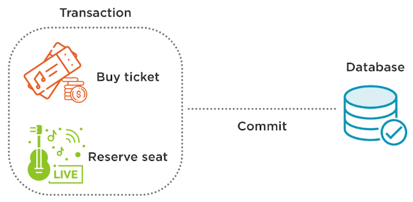

##### 1. Transaction
La transaction est une série d'actions qui sont traitées comme une seule unité de travail.
 
Bien qu'il existe plusieurs actions dans une seule transaction, toutes doivent échouer en tant que groupe ou se terminer entièrement en tant que groupe.

Lorsqu'une seule action du groupe échoue, toutes les actions doivent être annulées. Si toutes les actions sont terminées, la transaction doit être validée de manière permanente.

Il existe **quatre propriétés clés** des transactions qui peuvent être facilement mémorisées à l'aide de l'acronyme **ACID**.

* **Atomicité** : une transaction consiste en une série d'actions, et l'approche est une approche tout ou rien. La transaction doit soit se produire complètement, soit ne pas se produire du tout. Il ne peut pas se terminer partiellement.
* **Cohérence** : une transaction est validée une fois que toutes ses actions sont terminées. Cela maintient nos données dans un état cohérent.
* **Isolement** : chaque transaction est isolée des autres transactions pour garantir que les données ne sont pas corrompues. L'isolement garantit qu'une transaction ne peut pas lire les données d'une autre transaction.
* **Durabilité** : une transaction durable est une transaction qui ne peut pas être annulée par une défaillance du système, généralement parce qu'elle est écrite sur un stockage persistant.

##### 2. Gestion des transactions

La gestion des transactions garantit la cohérence et l'intégrité des données. 

La capacité de gérer correctement les transactions est essentielle au développement d'applications d'entreprise, car la plupart des applications d'entreprise conservent presque toujours les données dans une base de données. 

Sans gestion des transactions, les données pourraient se retrouver dans un état cohérent et être corrompues.

* Exemple : **l'achat d'un ticket de concert en ligne à l'aide d'une carte de crédit**

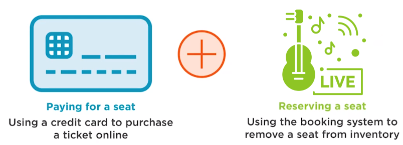

Dans un système de réservation de tickets, une réservation peut consister en deux actions distinctes qui forment ensemble une seule transaction, payer la place, puis réserver une place et le retirer de l'inventaire pour le client qui vient de payer.
 
Pensez maintenant à la situation où le montant est débité de la carte de crédit mais une place n'est jamais réservée ni confirmée pour le passager en raison d'une erreur système. Les données sont laissées dans un état incohérent. 

La transaction de réservation doit utiliser la gestion des transactions afin que les deux étapes soient effectuées comme une seule unité de travail et que toutes se terminent entièrement en tant que groupe ou échouent lorsqu'un groupe est annulé.

- Dans ce scénario, il est important de définir les limites correctes pour la transaction tout en répondant à ces questions:
    * Quand une transaction doit-elle commencer ? 
    * Quand une transaction doit-elle se terminer ? 
    * Quand la transaction doit-elle être validée dans la base de données ? 
    * Quand les données doivent-elles être annulées en cas d'exception ?
  
##### 3. Utilisation de la transaction avec Spring
Spring Boot et Spring Data JPA rendent la gestion des transactions extrêmement simple. Ils nous permettent de déclarer le traitement de transaction préféré et offrent une intégration transparente avec Hibernate et JPA.

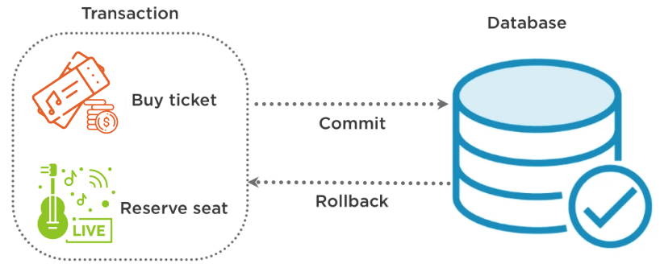

La gestion des transactions est une fonctionnalité utile que le framework Spring rend disponible immédiatement. 

Spring prend en charge la validation ou l'annulation automatique des transactions en cas d'échec.

Il existe plusieurs API différentes qui aident les développeurs à gérer les transactions : 
    
   * **Java Transaction API**
   * **Java Database Connectivity**
   * **Hibernate**
   * **Java Persistence API**
   * **Java Data Objects**
   * **Java Message Service**

L'avantage d'utiliser Spring pour gérer les transactions est qu'il fournit un modèle de programmation cohérent sur toutes les API. 

Par exemple, nous utilisons actuellement **JDO** pour nous aider à gérer nos transactions, et un jour, nous souhaitons passer à **Hibernate**.

¤ Si nous n'utilisons pas **Spring**, nous devrons apporter des modifications au codage pour prendre en charge la migration car **JDO et Hibernate** ont des API différentes pour la gestion des transactions.

¤ Si nous utilisons **Spring**, les modifications de codage ne sont pas nécessaires car spring fournit une API uniforme qui est plus simple pour la gestion des transactions par programmation que d'autres API complexes.

=> Spring fournit tout le code passe-partout nécessaire pour démarrer, valider ou annuler une transaction.

¤ Si nous utilisons **Spring Boot**, cela réduit les efforts à une annotation **@Transactional** sur chaque interface, méthode ou classe qui doit être executée dans un contexte transactionnel.

¤ Si nous n'utilisons pas **Spring Boot**, nous devrons activer la gestion des transactions en annotant la classe d'application avec **@EnableTransactionManagement**.

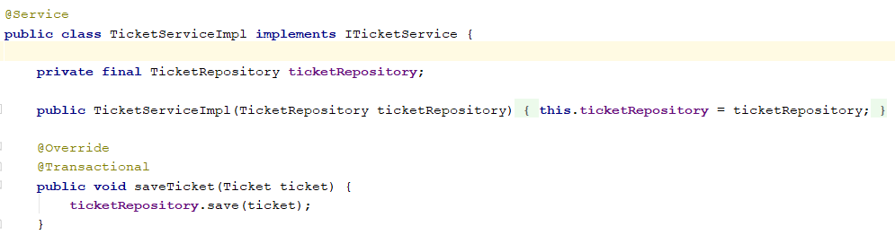

- L'annotation **@Transactional** indique à Spring s'une transaction est requise pour éxecuter cette méthode.
- Lorsque nous injections TicketService quelque part, Spring génère un objet proxy qui encapsule l'objet TicketService et fournit le code requis pour gérer la transaction.
- Ce proxyse charge de créer une transaction au début de l'appel de la méthode et de valider la transaction après l'exécution de la méthode ou de l'annuler si une RuntimeException ou une erreur s'est produite.

L'annotation **@Transactional** prend en charge un ensemble d'atttributs, les plus importants sont :

**Propagation, readOnly, rollbackFor et noRollbackFor**.

###### Définition de la propagation des transactions
L'attribut de propagation de l'annotation @Tansactional fournit sept valeurs possibles qui nous permettent de contrôler le traitement des transactions existantes et la création de nouvelles transactions.
* **REQUIRED** : pour dire à Spring de rejoindre une transaction active ou d'en démarrer une nouvelle si la méthode est appelée sans transaction. Ceci est le comportement par défaut.

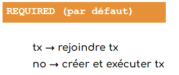

* **SUPPORTS** : pour rejoindre une transaction d'activation s'il en existe une. Si la méthode est appelée sans transaction active, cette méthode sera exécutée sans contexte transactionnel.
 
 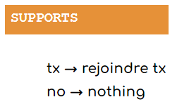

* **MANDATORY** : pour rejoindre une transaction d'activation s'il en existe une ou pour lever une exception si la méthode est appelée sans transaction active.

 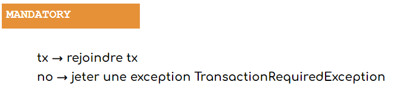

* **NEVER** : pour lever une exception si la méthode est appelée dans le contexte d'une transaction active.

 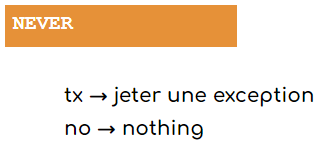

* **NOT_SUPPORTED** : pour suspendre une transaction active et exécuter la méthode sans aucun contexte transactionnel.
 
 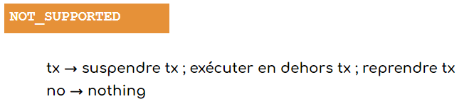

* **REQUIRES_NEW** : pour démarrer toujours une nouvelle transaction pour cette méthode. Si la méthode est appelée avec une transaction active, cette transaction est suspendue jusqu'à ce que cette méthode soit exécutée.
 
 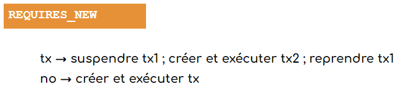

* **NESTED** : pour démarrer une nouvelle transaction si la méthode est appelée sans transaction active. S'il est appelé avec une transaction active, Spring définit un point de sauvegarde et revient à ce point de sauvegarde si une exception se produit.

 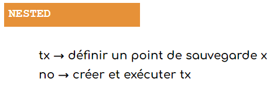
 
###### Utilisation de transaction en lecture seule
Depuis Spring 5.1, cela définit l' indice de requête d'Hibernate org.hibernate.readOnly et évite les vérifications sales sur toutes les entités récupérées.

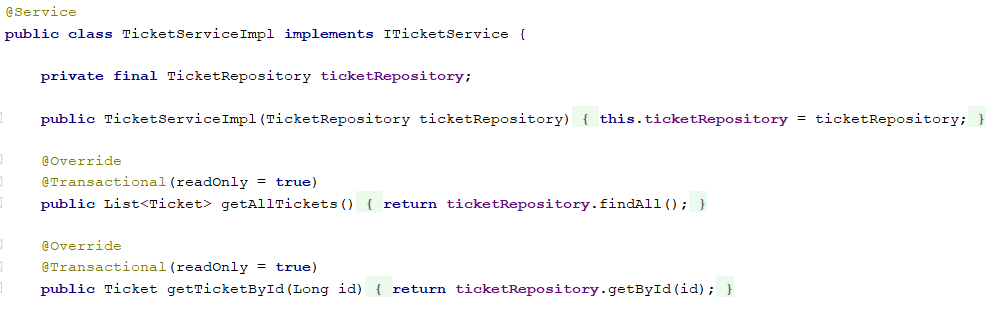

###### Gestion des exceptions

Nous avons dit que le proxy Spring annule automatiquement la transaction si une RuntimeException ou une erreur se produisait. Nous pouvaons personnaliser ce comportement à l'aide des attributs **rollbackFor** et **noRollbackFor** de l'annotation @Transactional.

¤ L'attribut **rollbackFor** nous permet de fournir un tableau de classes d'exception pour lesquelles la transaction doit être annulée.

¤ L'attribut **noRollbackFor** accepte un tableau de classes d'exception qui ne doit pas provoquer d'annulation de la transaction.

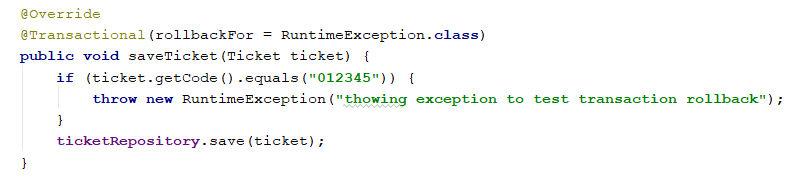

### Initialisation du projet
Pour amorcer une application Spring Boot , nous pouvons démarrer le projet à partir de zéro avec notre IDE préféré, ou simplement utiliser un autre moyen qui facilite la vie : [SpringInitializr](https://start.spring.io/)

Initialement, nous avons choisi les dépendances suivantes : Spring web, Spring Data JPA, Validation, Lombok et PostgreSQL Driver.

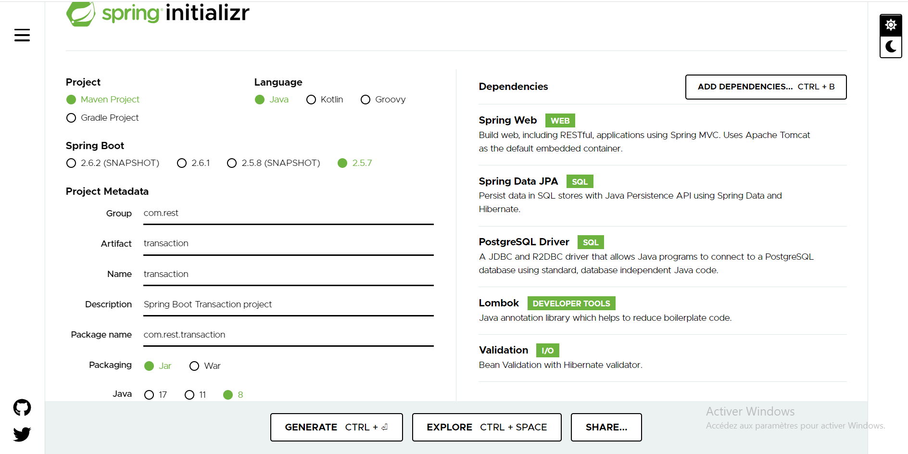

### Structure du projet
L'image ci-dessous montre la structure finale du projet

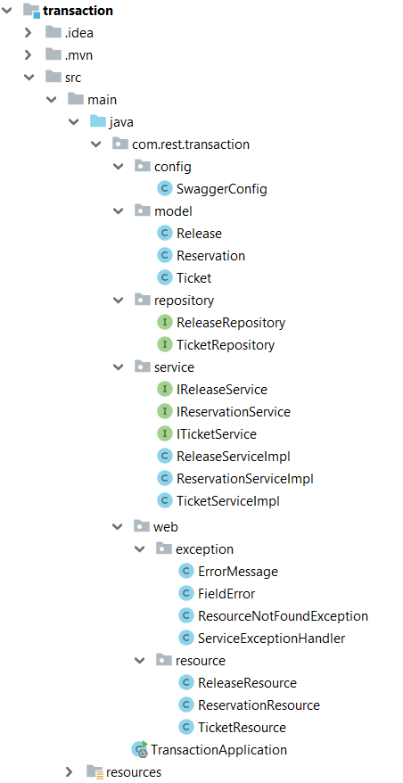

* **Pom.xml**

Contient des dépendances pour Spring Boot. Dans notre cas, nous sommes besoin de ces dépendances.

```xml
<dependencies>
		<dependency>
			<groupId>org.springframework.boot</groupId>
			<artifactId>spring-boot-starter-data-jpa</artifactId>
		</dependency>
		<dependency>
			<groupId>org.springframework.boot</groupId>
			<artifactId>spring-boot-starter-validation</artifactId>
		</dependency>
		<dependency>
			<groupId>org.springframework.boot</groupId>
			<artifactId>spring-boot-starter-web</artifactId>
		</dependency>

		<dependency>
			<groupId>org.postgresql</groupId>
			<artifactId>postgresql</artifactId>
			<scope>runtime</scope>
		</dependency>
		<dependency>
			<groupId>org.projectlombok</groupId>
			<artifactId>lombok</artifactId>
			<optional>true</optional>
		</dependency>
		<dependency>
			<groupId>org.springframework.boot</groupId>
			<artifactId>spring-boot-starter-test</artifactId>
			<scope>test</scope>
		</dependency>
		<dependency>
			<groupId>io.springfox</groupId>
			<artifactId>springfox-swagger2</artifactId>
			<version>2.9.2</version>
		</dependency>
		<dependency>
			<groupId>io.springfox</groupId>
			<artifactId>springfox-swagger-ui</artifactId>
			<version>2.9.2</version>
		</dependency>
    </dependencies>
```

* **Main Class**

C’est la classe principale de l’application et appelée aussi une classe de démarrage.

L ’adresse par défaut d’exécution : http://localhost:8080 

```java 
@SpringBootApplication
public class TransactionApplication {

	public static void main(String[] args) {
		SpringApplication.run(TransactionApplication.class, args);
	}

}
```
### I. Configuration PostgreSQL
* **application.properties**

Les propriétés **spring.datasource.username** et **spring.datasource.password** sont les mêmes que celles de votre installation de base de données.

Spring Boot utilise Hibernate pour l'implémentation JPA, nous configurons PostgreSQLDialect pour PostgreSQL 🡺 Ce dialecte nous permet de générer de meilleures requêtes SQL pour cette base de données.

**spring.jpa.hibernate.ddl-auto= update** est utilisé pour créer automatiquement les tables en fonction des classes d’entités dans l’application. Toute modification du modèle déclenche également une mise à jour de la table. 

Pour la production, cette propriété doit être **validate**, cette valeur valide le schéma en correspondance avec le mapping hibernate.

**logging.level.org.springframework=DEBUG** : pour activer logging 

```yaml
spring.datasource.url=jdbc:postgresql://localhost:5432/reservation_ticket_db
spring.datasource.username=reservationadmin
spring.datasource.password=admin

spring.jpa.properties.hibernate.dialect = org.hibernate.dialect.PostgreSQLDialect

spring.jpa.hibernate.ddl-auto=update

logging.level.org.springframework=DEBUG
```

### II. Modèle
* **Ticket.java**

L’entité « Ticket » est mappé à une table nommée « ticket » dans la base de données

- l'annotation **@Entity** indique que la classe est une classe Java persistante.

– l'annotation **@Table** fournit la table qui mappe cette entité.

– l'annotation **@Id** est pour la clé primaire.

– l'annotation **@GeneratedValue** est utilisée pour définir la stratégie de génération de la clé primaire. **GenerationType.SEQUENCE** signifie la génération de la clé primaire se fera par une séquence définie dans le SGBD, auquel on ajoute l’attribut generator.

– l'annotation **@Column** est utilisée pour définir la colonne dans la base de données qui mappe le champ annoté.
  
Ici, nous allons utiliser **Lombok** : est une bibliothèque Java qui se connecte automatiquement à un éditeur afin de générer automatiquement les méthodes getter ou equals à l'aide des annotations.
  
* **@Getter / @Setter** :  pour générer automatiquement le getter/setter par défaut.

```java
@Entity
@Getter
@Setter
@Table(name = "ticket")
public class Ticket {

    @Id
    @GeneratedValue(strategy = GenerationType.SEQUENCE, generator = "TICKET_SEQ")
    @SequenceGenerator(name = "TICKET_SEQ", sequenceName = "ticket_seq", allocationSize = 1)
    private Long id;

    @Column(name = "code")
    @NotBlank(message = "code ne doit pas être null ou vide")
    private String code;

    @Column(name = "title")
    @NotBlank(message = "title ne doit pas être null ou vide")
    @Size(min = 3, max = 20, message = "title doit être compris entre 3 et 20 caractères")
    private String title;

    @Column(name = "description")
    @NotBlank(message = "description ne doit pas être null ou vide")
    @Size(min = 3, max = 50, message = "description doit être compris entre 3 et 50 caractères")
    private String description;

    @Column(name = "date")
    @NotNull(message = "date ne doit pas être nulle")
    @JsonFormat(shape = JsonFormat.Shape.STRING, pattern = "yyyy-MM-dd")
    private LocalDate date;

    @Column(name = "price")
    @NotNull(message = "price ne doit pas être null")
    private Long price;

    @Column(name = "sector")
    @NotBlank(message = "sector ne doit pas être null ou vide")
    private String sector;

    @Column(name = "row")
    @NotNull(message = "row ne doit pas être null")
    private Long row;

    @Column(name = "seat")
    @NotNull(message = "seat ne doit pas être null")
    private Long seat;
}
```

* **Release.java**

L’entité « Release » est mappé à une table nommée « release » dans la base de données

– l'annotation **@JsonFormat** est utilisé au niveau du champ pour formater la date "yyy-MM-dd".

```java
@Entity
@Getter
@Setter
@Table(name = "release")
public class Release {

    @Id
    @GeneratedValue(strategy = GenerationType.SEQUENCE, generator = "RELEASE_SEQ")
    @SequenceGenerator(name = "RELEASE_SEQ", sequenceName = "release_seq" ,allocationSize = 1)
    private Long id;

    @Column(name = "name")
    @NotBlank(message = "name ne doit pas être null ou vide")
    @Size(min = 3, max = 20, message = "name doit être compris entre 3 et 20 caractères")
    private String name;

    @Column(name = "description")
    @NotBlank(message = "description ne doit pas être null ou vide")
    @Size(min = 3, max = 50, message = "description doit être compris entre 3 et 50 caractères")
    private String description;

    @Column(name = "release_date")
    @NotNull(message = "date ne doit pas être nulle")
    @JsonFormat(shape = JsonFormat.Shape.STRING, pattern = "yyyy-MM-dd")
    private LocalDate releaseDate;
}
```
* **Reservation.java**

La classe **Reservation** est une classe de projection qui va retourner les deux propriétés "ticket" et "release".
```java
@Getter
@Setter
public class Reservation {
    @NotNull(message = "ticket ne doit pas être null")
    private Ticket ticket;
    @NotNull(message = "release ne doit pas être nulle")
    private Release release;
}
```

### III. Reposirory
Spring framework nous fournit des repositories afin d’encapsuler des détails de la couche de persistance et de fournir une interface CRUD pour une seule entité ⇒ la possibilité de générer toutes sortes d'opérations vers la base de données.

**Spring Data JPA** est le module qui nous permet d’interagir avec une base de données relationnelles en représentant les objets du domaine métier sous la forme d’entités JPA.

L’annotation **@Repository** est une spécialisation de l’annotation **@Component** ⇒ Pour indiquer que la classe définit un référentiel de données

* **TicketRepository.java**

Cette interface est utilisée pour accéder aux données de la table **ticket** et qui s'étend de JpaRepository.

```java
@Repository
public interface TicketRepository extends JpaRepository<Ticket, Long> {
}
```

* **ReleaseRepository.java**

Cette interface est utilisée pour accéder aux données de la table **release** et qui s'étend de JpaRepository.

```java
@Repository
public interface ReleaseRepository extends JpaRepository<Release, Long> {
}
```

### IV. Service
* **ITicketService**

```java
public interface ITicketService {

    List<Ticket> getAllTickets();

    void saveTicket(Ticket ticket);

    void updateTicket(Ticket ticket);

    Ticket getTicketById(Long id);

    void deleteTicketById(Long id);
}
```
* **IReleaseService**
```java
public interface IReleaseService {

    List<Release> getAllReleases();

    void saveRelease(Release release);

    void updateRelease(Release release);

    Release getReleaseById(Long id);

    void deleteReleaseById(Long id);
}
```
* **IReservationService**
```java
public interface IReservationService {

    void scheduleReservation(Reservation reservation);

    void cancelReservation(Reservation reservation);

}
```
* **TicketServiceImpl**

L'annotation **@Transactional** peut être utilisée pour indiquer au conteneur les méthodes qui doivent s'exécuter dans un contexte transactionnel.

L’annotation **@Transactional(readOnly = true)** permet d’indiquer si la transaction est en lecture seule (false par défaut) ⇒ Pour les interactions avec les bases de données, les transactions en lecture seule signifient que l’on n’effectue que des requêtes pour lire des données.

```java
@Service
@Transactional
public class TicketServiceImpl implements ITicketService {

    private final TicketRepository ticketRepository;

    public TicketServiceImpl(TicketRepository ticketRepository) {
        this.ticketRepository = ticketRepository;
    }

    @Override
    @Transactional(readOnly = true)
    public List<Ticket> getAllTickets() {
        return ticketRepository.findAll();
    }

    @Override
    @Transactional(readOnly = true)
    public Ticket getTicketById(Long id) {
        return ticketRepository.findById(id).orElseThrow(() -> new ResourceNotFoundException("Not found ticket with id = " + id));
    }

    @Override
    public void saveTicket(Ticket ticket) {
        ticketRepository.save(ticket);
    }

    @Override
    public void updateTicket(Ticket ticket) {
          ticketRepository.findById(ticket.getId())
                  .orElseThrow(() -> new ResourceNotFoundException("Not found ticket with id = " + ticket.getId()));
          ticketRepository.save(ticket);
      }


    @Override
    public void deleteTicketById(Long id) {
        ticketRepository.findById(id)
                .orElseThrow(() -> new ResourceNotFoundException("Not found ticket with id = " + id));
        ticketRepository.deleteById(id);
    }
}
```

* **ReleaseServiceImpl**

```java
@Service
@Transactional
public class ReleaseServiceImpl implements IReleaseService {

    private static final Logger log = LoggerFactory.getLogger(ReleaseServiceImpl.class);

    private final ReleaseRepository releaseRepository;


    public ReleaseServiceImpl(ReleaseRepository releaseRepository) {
        this.releaseRepository = releaseRepository;
    }

    @Override
    @Transactional(readOnly = true)
    public List<Release> getAllReleases() {
        return releaseRepository.findAll();
    }

    @Override
    public void saveRelease(Release release) {
        releaseRepository.save(release);
    }

    @Override
    public void updateRelease(Release release) {
        releaseRepository.findById(release.getId())
                .orElseThrow(() -> new ResourceNotFoundException("Not found release with id = " + release.getId()));
        releaseRepository.save(release);
    }

    @Override
    @Transactional(readOnly = true)
    public Release getReleaseById(Long id) {
        return releaseRepository.findById(id).orElseThrow(() -> new ResourceNotFoundException("Not found release with id = " + id));
    }

    @Override
    public void deleteReleaseById(Long id) {
        releaseRepository.findById(id).orElseThrow(() -> new ResourceNotFoundException("Not found release with id = " + id));
        releaseRepository.deleteById(id);
    }
}
```

* **ReservationServiceImpl**

```java
@Service
@Transactional
public class ReservationServiceImpl implements IReservationService {

    private final IReleaseService releaseService;

    private final ITicketService ticketService;

    public ReservationServiceImpl(IReleaseService releaseService, ITicketService ticketService) {
        this.releaseService = releaseService;
        this.ticketService = ticketService;
    }

    @Override
    public void scheduleReservation(Reservation reservation) {
        ticketService.saveTicket(reservation.getTicket());
        if (reservation.getTicket().getCode().equals("012345")) {
            throw new RuntimeException("thowing exception to test transaction rollback");
        }
        releaseService.saveRelease(reservation.getRelease());

    }

    @Override
    public void cancelReservation(Reservation reservation) {
        ticketService.deleteTicketById(reservation.getTicket().getId());
        releaseService.deleteReleaseById(reservation.getRelease().getId());
    }
}
```

### V. Resource

- Les codes de réponse HTTP: 

    * **200 Success** : La demande a réussi
    * **201 Created** : La demande a été satisfaite et a entraîné la création d'une nouvelle ressource
    * **204 No Content** : La demande a répondu à la demande mais n'a pas besoin de retourner un corps d'entité
    * **400 Bad Request** : La requête n'a pas pu être comprise par le serveur en raison d'une syntaxe mal formée
    * **404 Not Found** : Le serveur n'a rien trouvé correspondant à l'URI de la requête
    * **409 Conflict** : La demande n'a pas pu être traitée en raison d'un conflit avec l'état actuel de la ressource

* **TicketResource**

Ce contrôleur expose des end-point pour faire les CRUD (créer, récupérer, mettre à jour, supprimer et trouver) des tickets.

##### Points de terminaison d’API

| Méthode HTTP | URI | Description | Codes d'états http |
| ------------- | ------------- | ------------- | ------------- |
| POST  | /api/tickets  | Créer une chanson  | 201  |
| PUT  | /api/tickets/{id}  | Modifier un ticket  | 200, 404  |
| GET  | /api/tickets/{id}  | Récupérer un ticket | 200, 404 |
| GET  | /api/tickets  | Récupérer tous les tickets  | 200  |
| DELETE  | /api/tickets/{id}  | Supprimer un tickets | 204, 404  |

– l'annotation **@RestController** est utilisée pour définir un contrôleur.

⇒ **@RestController** remplace principalement :

**@Controller** : pour dire que c'est un controlleur, pour que spring le charge dans son context, et pour le rendre singleton.

**@ResponseBody** : pour indiquer que la valeur de retour des méthodes doit être liée au corps de la réponse Web.

**@RequestMapping("/api/tickets")** déclare que toutes les URL d'Apis dans le contrôleur commenceront par /api/tickets.

– Nous avons injecté la classe **ITicketService** par constructeur.

```java
@RestController
@RequestMapping("/api/tickets")
public class TicketResource {

    private final ITicketService ticketService;

    public TicketResource(ITicketService ticketService) {
        this.ticketService = ticketService;
    }

    @GetMapping
    public ResponseEntity<List<Ticket>> getAllTickets() {
        return new ResponseEntity<>(ticketService.getAllTickets(), HttpStatus.OK);
    }

    @PostMapping
    public ResponseEntity saveTicket(@Valid @RequestBody Ticket ticket) {
        ticketService.saveTicket(ticket);
        return new ResponseEntity<>(HttpStatus.CREATED);
    }

    @PutMapping
    public ResponseEntity updateTicket(@Valid @RequestBody Ticket ticket) {
        ticketService.updateTicket(ticket);
        return new ResponseEntity<>(HttpStatus.OK);
    }

    @GetMapping("/{id}")
    public ResponseEntity<Ticket> getTicketById(@PathVariable Long id) {
        return new ResponseEntity<>(ticketService.getTicketById(id), HttpStatus.OK);
    }

    @DeleteMapping("/{id}")
    public ResponseEntity deleteTicketById(@PathVariable Long id) {
        ticketService.deleteTicketById(id);
        return new ResponseEntity<>(HttpStatus.NO_CONTENT);
    }
}
```

* **ReleaseResource**

Ce contrôleur expose des end-point pour faire les CRUD (créer, récupérer, mettre à jour, supprimer et trouver) des releases.

##### Points de terminaison d’API

| Méthode HTTP | URI | Description | Codes d'états http |
| ------------- | ------------- | ------------- | ------------- |
| POST  | /api/releases  | Créer une release  | 201  |
| PUT  | /api/releases/{id}  | Modifier une release  | 200, 404  |
| GET  | /api/releases/{id}  | Récupérer une release | 200, 404 |
| GET  | /api/releases  | Récupérer toutes les releases  | 200  |
| DELETE  | /api/releases/{id}  | Supprimer une release | 204, 404  |

**@RequestMapping("/api/releases")** déclare que toutes les URL d'Apis dans le contrôleur commenceront par /api/releases.

– Nous avons injecté la classe **IReleaseService** par constructeur.

```java
@RestController
@RequestMapping("/api/releases")
public class ReleaseResource {

    private final IReleaseService releaseService;

    public ReleaseResource(IReleaseService releaseService) {
        this.releaseService = releaseService;
    }

    @GetMapping
    public ResponseEntity<List<Release>> getAllReleases(){
        return new ResponseEntity<>(releaseService.getAllReleases(), HttpStatus.OK);
    }

    @PostMapping
    public ResponseEntity saveRelease(@Valid @RequestBody Release release){
        releaseService.saveRelease(release);
        return new ResponseEntity<>(HttpStatus.CREATED);
    }

    @PutMapping
    public ResponseEntity updateRelease(@Valid @RequestBody Release release){
        releaseService.updateRelease(release);
        return new ResponseEntity<>(HttpStatus.OK);
    }

    @GetMapping("/{id}")
    public ResponseEntity getReleaseById(@PathVariable Long id){
        releaseService.getReleaseById(id);
        return new ResponseEntity<>(HttpStatus.OK);
    }

    @DeleteMapping("/{id}")
    public ResponseEntity deleteReleaseById(@PathVariable Long id){
        releaseService.deleteReleaseById(id);
        return new ResponseEntity<>(HttpStatus.NO_CONTENT);
    }
}
```
* **ReservationResource**

Ce contrôleur expose des end-point pour faire les CRUD (créer, et supprimer) une release et un ticket .

##### Points de terminaison d’API

| Méthode HTTP | URI | Description | Codes d'états http |
| ------------- | ------------- | ------------- | ------------- |
| POST  | /api/releases  | Créer une release  | 201  |
| PUT  | /api/releases/{id}  | Modifier une release  | 200  |
| GET  | /api/releases/{id}  | Récupérer une release | 200 |
| GET  | /api/releases  | Récupérer toutes les releases  | 200  |
| DELETE  | /api/releases/{id}  | Supprimer une release | 204  |

**@RequestMapping("/api")** déclare que toutes les URL d'Apis dans le contrôleur commenceront par /api.

– Nous avons injecté la classe **IReservationService** par constructeur.

```java
@RestController
@RequestMapping("/api")
public class ReservationResource {

    private final IReservationService reservationService;

    public ReservationResource(IReservationService reservationService) {
        this.reservationService = reservationService;
    }


    @PostMapping("/schedule")
    public ResponseEntity scheduleReservation(@Valid @RequestBody Reservation reservation){
        reservationService.scheduleReservation(reservation);
        return new ResponseEntity<>(HttpStatus.CREATED);
    }

    @DeleteMapping("/cancel")
    public ResponseEntity cancelReservation(@Valid @RequestBody Reservation reservation){
        reservationService.cancelReservation(reservation);
        return new ResponseEntity<>(HttpStatus.NO_CONTENT);
    }
}
```

### VI. Documentation des API Spring Rest à l'aide de Swagger : Package « config »
Swagger est le framework d'API le plus populaire avec une prise en charge de plus de 40 langues différentes. Nous pouvons utiliser swagger pour concevoir, construire et documenter nos REST API.

```java
@Configuration
@EnableSwagger2
public class SwaggerConfig {

    @Bean
    public Docket api() {

        return new Docket(DocumentationType.SWAGGER_2)
                .apiInfo(apiInfo())
                .select()
                .apis(RequestHandlerSelectors.any())
                .paths(paths()::test)
                .build();

    }

    private ApiInfo apiInfo() {
        return new ApiInfoBuilder()
                .title("Swagger Playlists APIs")
                .description("This page lists all the rest apis for Playlists App.")
                .version("1.0")
                .build();
    }

    private Predicate<String> paths() {
        return ((Predicate<String>) regex("/error.*")::apply).negate()
                .and(regex("/.*")::apply);
    }
}
```

Utiliser cette url : **http://localhost:8080/swagger-ui.html**

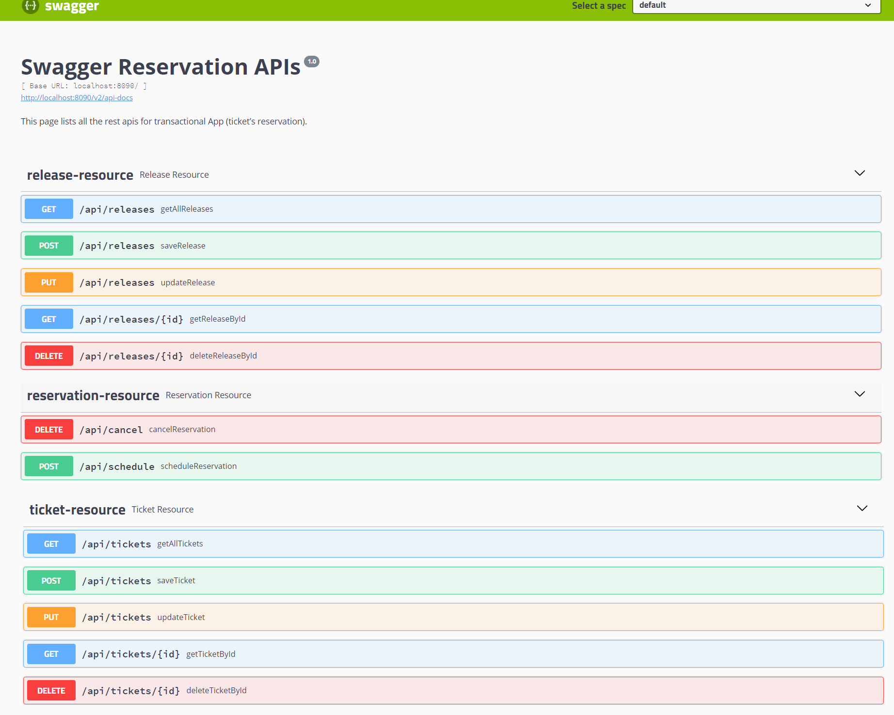

### VIII. Exceptions

* **@Builder** : nous permet de produire automatiquement le code requis pour que la classe soit instanciable et aussi pour éviter la complexité des constructeurs

* La classe **ErrorMessage**

```java
@Getter
class ErrorMessage {

    private int statusCode;
    private Date timeStamp;
    private String message;
    private String description;
    private List<FieldError> fieldErrors;

    @Builder
    private ErrorMessage(int statusCode, Date timeStamp, String message, String description, List<FieldError> fieldErrors) {
        this.statusCode = statusCode;
        this.timeStamp = timeStamp;
        this.message = message;
        this.description = description;
        this.fieldErrors = fieldErrors;
    }
}
```

* La classe **FieldError**

```java
/**
 * instead of using default error response provided by Spring Boot,
 * FieldError class is part of ErrorMessage class to definr error response message
 */

@Getter
class FieldError {

    private String objectName;

    private String field;

    private String message;

    @Builder
    private FieldError(String objectName, String field, String message) {
        this.objectName = objectName;
        this.field = field;
        this.message = message;
    }
}
```

* **Gestion des exceptions : créer une exception personnalisée**

Spring prend en charge la gestion des exceptions par :
-	Un gestionnaire d'exceptions global (@ExceptionHandler )
-	Controller Advice (@ControllerAdvice )

L’annotation @ControllerAdvice est la spécialisation de l’annotation @Component afin qu'elle soit détectée automatiquement via l'analyse du chemin de classe. Un Conseil de Contrôleur est une sorte d'intercepteur qui entoure la logique de nos Contrôleurs et nous permet de leur appliquer une logique commune.

Les méthodes (annotées avec @ExceptionHandler) sont partagées globalement entre plusieurs composants @Controller pour capturer les exceptions et les traduire en réponses HTTP.

L’annotation @ExceptionHandler indique quel type d'exception nous voulons gérer. L'instance exception et le request seront injectés via des arguments de méthode.
 
 ⇨	En utilisant deux annotations ensemble, nous pouvons : contrôler le corps de la réponse avec le code d'état et gérer plusieurs exceptions dans la même méthode.

* Nous allons lancer une exception pour la ressource introuvable dans le contrôleur Spring Boot.Créons une classe ResourceNotFoundException qui étend RuntimeException.

```java
/**
 * ResourceNotFoundException class extends RuntimeException.
 * It's about a custom exception :
 * throwing an exception for resource not found in Spring Boot Service
 * ResourceNotFoundException is thrown with Http 404
 */

public class ResourceNotFoundException extends RuntimeException {

    public ResourceNotFoundException(String message) {
        super(message);
    }
}
```

* La classe ServiceExceptionHandler gère deux exceptions spécifiques (ResoureNotFoundException et MethodArgumentNotValidException) et les exceptions globales à un seul endroit.
 
```java
@ControllerAdvice
public class ServiceExceptionHandler {
    
    @ExceptionHandler(ResourceNotFoundException.class)
    public ResponseEntity<ErrorMessage> handleResourceNotFoundException(ResourceNotFoundException e, WebRequest request) {
        ErrorMessage message =
                ErrorMessage.builder()
                        .statusCode(HttpStatus.NOT_FOUND.value())
                        .timeStamp(new Date())
                        .message(e.getMessage())
                        .description(request.getDescription(false))
                        .build();

        return new ResponseEntity<>(message, HttpStatus.NOT_FOUND);
    }

    @ExceptionHandler(MethodArgumentNotValidException.class)
    public final ResponseEntity<ErrorMessage> handleArgumentNotValidException(MethodArgumentNotValidException e, WebRequest request) {

        BindingResult result = e.getBindingResult();
        List<FieldError> fieldErrors = result.getFieldErrors().stream()
                .map(f -> FieldError
                        .builder()
                        .objectName(f.getObjectName())
                        .field(f.getField())
                        .message(f.getCode() + ": " + f.getDefaultMessage())
                        .build())
                .collect(Collectors.toList());

        ErrorMessage message =
                ErrorMessage.builder()
                        .statusCode(HttpStatus.BAD_REQUEST.value())
                        .timeStamp(new Date())
                        .message(e.getMessage())
                        .description(request.getDescription(false))
                        .fieldErrors(fieldErrors)
                        .build();


        return new ResponseEntity<>(message, HttpStatus.BAD_REQUEST);
    }

    @ExceptionHandler(Exception.class)
    public ResponseEntity<ErrorMessage> globalException(Exception e, WebRequest request) {
        ErrorMessage message =
                ErrorMessage.builder()
                        .statusCode(HttpStatus.INTERNAL_SERVER_ERROR.value())
                        .timeStamp(new Date())
                        .message(e.getMessage())
                        .description(request.getDescription(false))
                        .build();

        return new ResponseEntity<>(message, HttpStatus.INTERNAL_SERVER_ERROR);
    }
}
```

### VIII. A noter
Afin d'examiner les différents scénarios de propagation en observant le comportement du service Reservation et Ticket/Release, nous pouvons ajouter les attributs souhaités en paramètres de l'annotation **@Transactional**.

Nous pouvons appeler le service **ticket/release** dans les deux sens, c'est-à-dire

* Appeler en utilisant le service **réservation**

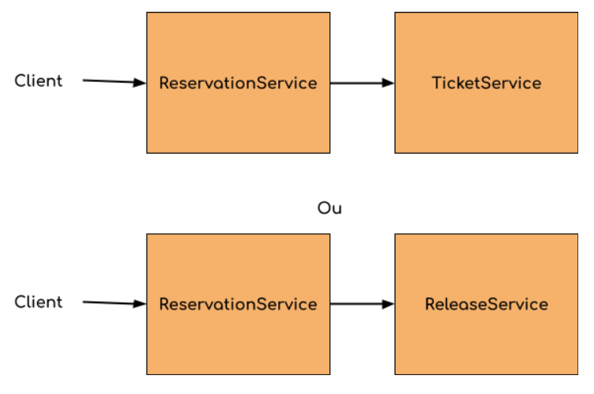

Exemple d'exécution avec la propagation par défaut **"REQUIRED"**

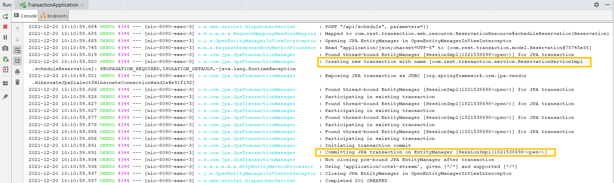

* Appeler directement le Service **Ticket/Release**.

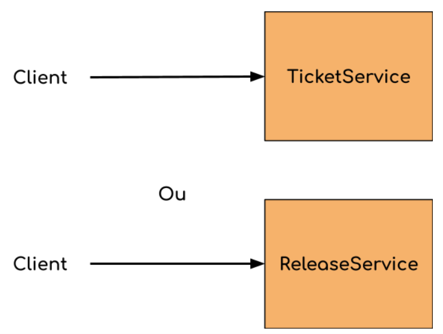

Exemple d'exécution avec la propagation par défaut **"REQUIRED"**

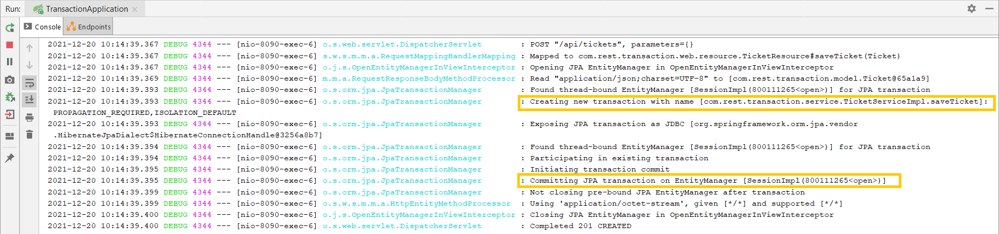

